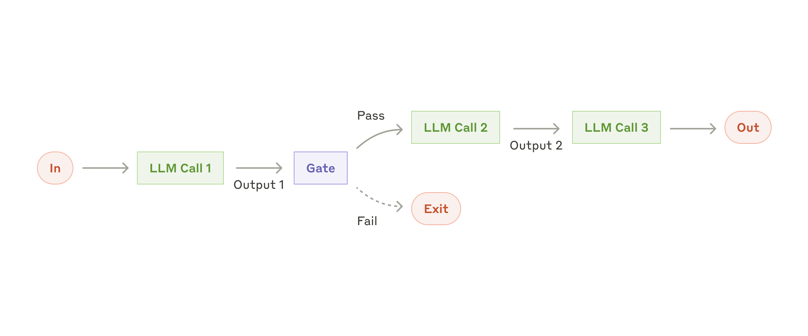
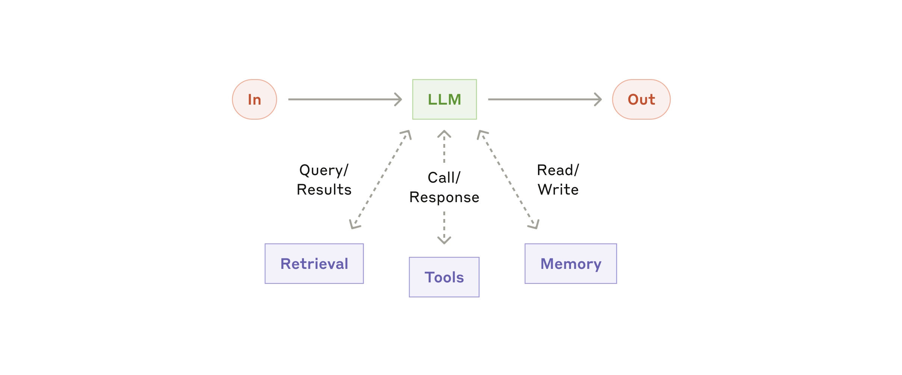
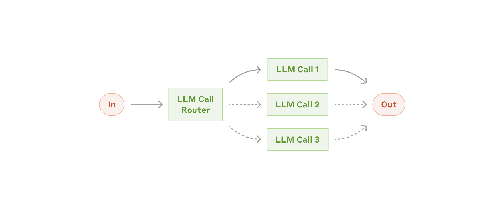
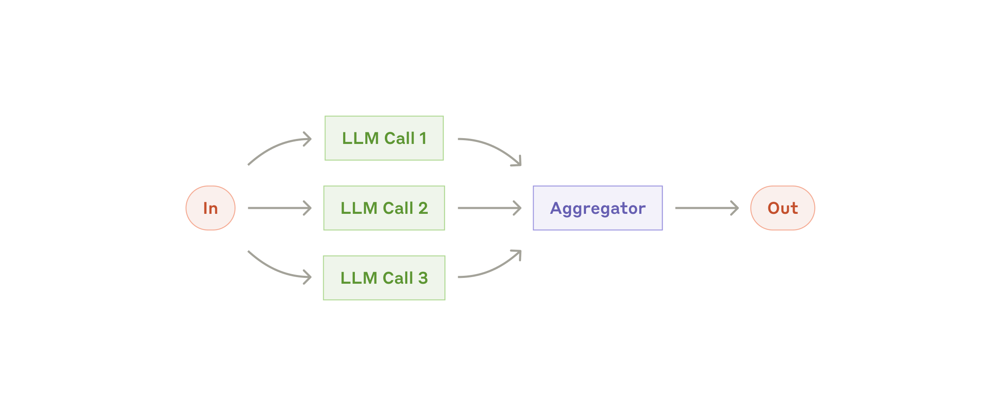
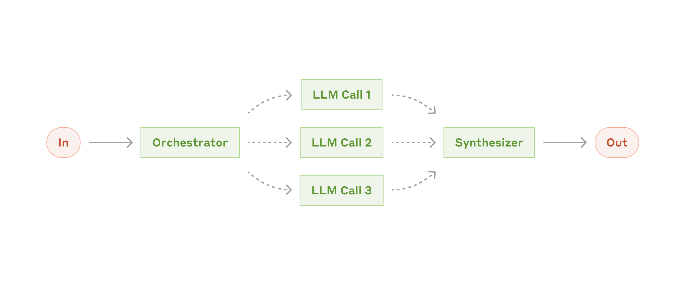
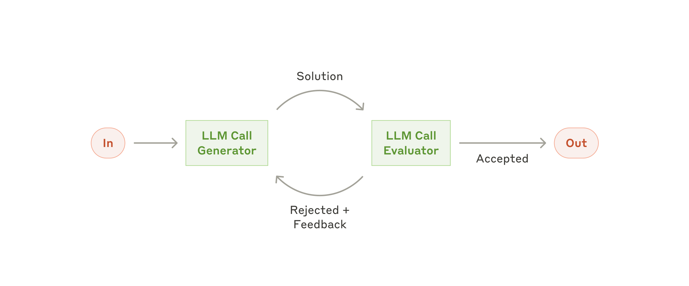
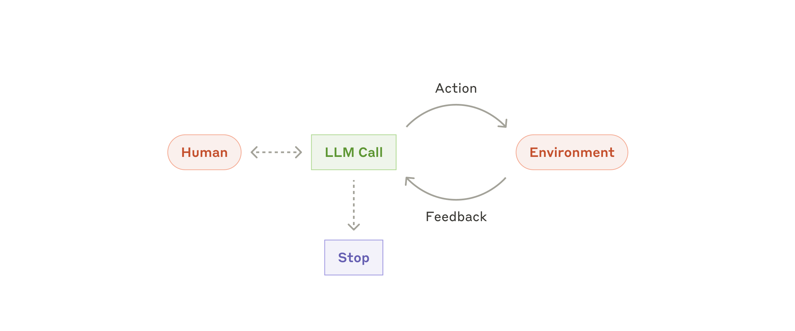
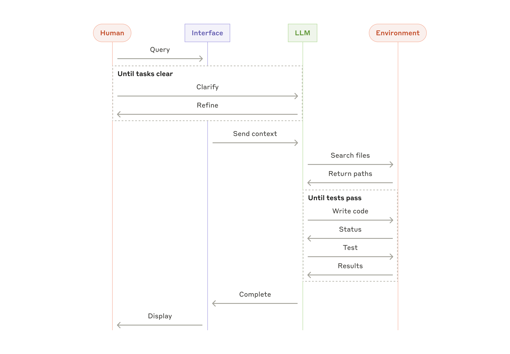

# 构建高效的 AI Agent（Anthropic 官方译文）

> 原文：[*Building effective agents*](https://www.anthropic.com/engineering/building-effective-agents) — Erik Schluntz & Barry Zhang (Anthropic), 2024-12-19
> 更新于 2026-08-10

---

过去一年，我们与数十个跨行业团队合作构建大语言模型（LLM）驱动的 agent。我们发现，最成功的实现并非依赖复杂的框架或专门的代码库，而是使用简单、可组合的模式。

本文分享我们从与客户合作以及自主构建 agent 中总结的经验，并为开发者构建高效 agent 提供实用建议。

## 什么是 Agent？

"Agent"有多种定义。部分客户将 Agent 定义为完全自主的系统，能够在较长时间内独立运作，使用多种工具来完成复杂任务。另一些客户则用这个词描述那些遵循预定义工作流的更具规定性的实现。在 Anthropic，我们将所有这些变体归入 **agent 系统（agentic system）** 这一范畴，但在工作流（workflow）和 agent 之间做了一个重要的架构区分：

- **工作流（Workflow）**：通过预定义的代码路径编排 LLM 和工具的系统。
- **Agent**：由 LLM 动态指导自身流程和工具使用的系统——由 LLM 自主决定如何完成任务。

以下将详细探讨这两种 agent 系统。在附录 1（"Agent 的实际应用"）中，我们将描述客户发现这两种系统特别有价值的两个领域。

## 何时（以及何时不）使用 Agent

使用 LLM 构建应用时，我们建议寻找尽可能简单的解决方案，只在必要时增加复杂性。这可能意味着根本不构建 agent 系统。Agent 系统通常以延迟和成本换取更好的任务表现，你需要考虑这种权衡何时是合理的。

当更高的复杂性值得时，工作流为定义明确的任务提供了可预测性和一致性，而 agent 则是在规模化时需要灵活的模型驱动决策的更好选择。

然而，对于许多应用场景，通过检索增强生成（RAG）优化单次 LLM 调用通常就足够了。

## 当框架有用时

有许多框架可以使 agent 系统的实现更容易，包括：

- 来自 Anthropic 的 `langchain/langgraph` 所使用的 `Claude SDK`（正式名称为 Anthropic SDK）
- Amazon 的 `Strands Agents SDK`
- Vercel 的 `AI SDK`
- Mastra
- 以及众多其他框架

不过这些框架往往通过增加抽象层而使底层 prompt 和响应更难调试。它们也可能诱使开发者在更简单的设置就足够时增加不必要的复杂性。

因此，我们建议开发者从直接使用 LLM API 开始：许多模式都可以通过几行代码实现。如果一定要使用某个框架，请确保你理解底层代码——对底层原理的错误假设是客户错误的常见来源。

请参阅我们的[代码示例](https://github.com/anthropics/anthropic-cookbook/tree/main/patterns/agents)来了解示例实现。

## 构建块、工作流与 Agent

在本节中，我们探讨 agent 系统的常见模式。我们将从基础构建块——增强型 LLM——开始，逐步增加复杂性，从简单的组合工作流到自主 agent。

### 构建块：增强型 LLM（The Augmented LLM）

agent 系统的基本构建块是经过检索、工具使用和记忆等增强的 LLM。我们目前的模型能够主动生成搜索查询、选择合适的工具，并确定保留哪些信息。

  
  
图 1. 增强型 LLM（Augmented LLM）

我们建议重点关注实现的两个关键方面：根据具体用例定制这些能力，并确保它们为 LLM 提供简单、文档完备的接口。虽然实现这些增强功能的方式有很多，但其中一种方法是通过我们最近发布的[模型上下文协议（Model Context Protocol，MCP）](https://www.anthropic.com/news/model-context-protocol)，该协议允许开发者通过简单的[客户端实现](https://github.com/modelcontextprotocol)与不断增长的第三方工具生态系统集成。

在本文的剩余部分，我们假设每次 LLM API 调用都可以访问这些增强功能。

### 工作流：提示链（Prompt Chaining）

提示链将任务分解为一系列步骤，每次 LLM 调用处理前一步的输出。你可以在任何中间步骤添加程序化检查（见下图中的"gate"）以确保流程仍在正轨。

  
  
图 2. 提示链工作流（Prompt Chaining）

**何时使用此工作流**：当任务可以干净地分解为固定的子任务时，此工作流最为理想。主要目标是通过让每次 LLM 调用处理更简单的任务，用延迟换取更高的准确率。

**提示链有用的场景示例**：
- 生成营销文案，然后将其翻译成不同语言。
- 撰写文档大纲，检查大纲是否符合特定标准，然后根据大纲撰写文档。

### 工作流：路由（Routing）

路由对输入进行分类，并将其引导至专门的后续任务。此工作流允许关注点分离并构建更专门的 prompt。如果没有此工作流，为某一输入类型优化可能会损害其他输入的性能。

  
  
图 3. 路由工作流（Routing）

**何时使用此工作流**：路由适用于存在明显不同类别、需要分别处理的复杂任务，并且分类可以由 LLM 或更传统的分类模型/算法准确处理。

**路由有用的场景示例**：
- 将客户服务查询引导至不同的下游流程、prompt 和指令集（一般问题、退款请求、技术支持）。
- 将简单/常见问题路由到较小的模型（如 Claude 3.5 Haiku），将困难/不寻常问题路由到功能更强大的模型（如 Claude Opus），以优化成本和速度。

### 工作流：并行化（Parallelization）

LLM 有时可以同时处理一个任务，然后通过程序化方式聚合其输出。并行化工作流有两种关键变体：

- **分段（Sectioning）**：将任务分解为并行运行的独立子任务。
- **投票（Voting）**：多次运行同一任务以获得不同输出或多样化的视角。

  
  
图 4. 并行化工作流（Parallelization）

**何时使用此工作流**：当划分的子任务可以并行化以提高速度，或者当需要多个视角或尝试以获得更高置信度的结果时，并行化非常有效。对于涉及多种考量的复杂任务，当每个考量由单独的 LLM 调用处理时，LLM 通常表现更好——这允许对每个特定方面进行集中关注。

**并行化有用的场景示例**：

- **分段**
  - 实现护栏：一个模型实例处理用户查询，另一个实例筛查不当内容或请求。这种方式通常比让同一个 LLM 调用同时处理护栏和核心响应效果更好。
  - 自动化评测评估性能：每次 LLM 调用评估模型在给定 prompt 上的某个不同性能方面。

- **投票**
  - 审查一段代码是否存在漏洞：多个不同 prompt 审查代码并在发现问题时标记。
  - 评估某条内容是否不当：多个 prompt 评估不同方面，并要求多数票决定。

### 工作流：编排器-工作者（Orchestrator-Workers）

在编排器-工作者工作流中，一个中央 LLM 动态分解任务，将它们委托给工作者 LLM，并综合其结果。

  
  
图 5. 编排器-工作者工作流（Orchestrator-Workers）

**何时使用此工作流**：此工作流非常适用于那些无法预测所需子任务的复杂任务（例如，在编程中，需要修改的文件数量以及每个文件的修改性质取决于具体任务）。虽然它在拓扑结构上与并行化相似，但关键区别在于其灵活性——子任务不是预定义的，而是由编排器根据具体输入确定。

**编排器-工作者有用的场景示例**：
- 每次对多个文件进行复杂修改的编程产品。
- 涉及从多个来源收集和分析可能相关信息以进行搜索的搜索任务。

### 工作流：评估器-优化器（Evaluator-Optimizer）

在评估器-优化器工作流中，一个 LLM 调用生成响应，另一个调用在循环中提供评估和反馈。

  
  
图 6. 评估器-优化器工作流（Evaluator-Optimizer）

**何时使用此工作流**：当我们有明确的评估标准，并且迭代优化能带来可测量的价值时，此工作流特别有效。良好契合度的两个标志是：首先，当人类明确表述反馈时，LLM 的响应可以明显改进；其次，LLM 能够提供此类反馈。这类似于人类作者在生成精美文档时可能经历的迭代写作过程。

**评估器-优化器有用的场景示例**：
- 文学翻译，其中译者 LLM 可能最初无法捕捉的细微差别，但评估器 LLM 可以提供有用的批评。
- 需要多轮搜索和分析以收集全面信息的复杂搜索任务，其中评估器决定是否有必要进行进一步搜索。

### Agent

随着 LLM 在理解复杂输入、推理和规划、可靠使用工具以及错误恢复等关键能力上的成熟，agent 正在投入生产。agent 从人类用户的命令或交互式讨论开始其工作。一旦任务明确，agent 就会独立规划和运作，可能在需要进一步信息或判断时返回人类。在执行过程中，agent 必须在每个步骤（例如工具调用结果或代码执行）从环境中获取"真实情况"以评估其进展。agent 可以在检查点或遇到阻碍时暂停以获取人类反馈。任务通常在完成后终止，但通常也会包括停止条件（例如最大迭代次数）以保持控制。

agent 可以处理复杂的任务，但它们的实现通常很直接。它们通常只是使用工具并根据环境反馈循环的 LLM。因此，清晰且深思熟虑地设计工具及其文档至关重要。我们在附录 2（"工具的工程化提示"）中展开了工具文档的最佳实践。

  
  
图 7. 自主 Agent

**何时使用 Agent**：agent 可用于那些对需要多少步骤的开放式问题，或者你无法硬编码固定路径的问题。agent 的自主性使其成为在可信环境中扩展任务的理想选择。

agent 的自主性意味着更高的成本——以及复合错误的可能性。我们建议在沙箱环境中进行广泛的测试，并设置适当的护栏。

**Agent 有用的场景示例**：
以下示例来自我们自己的实现：

- 一个解决 [SWE-bench 任务](https://www.anthropic.com/research/swe-bench-sonnet)的编码 agent，它根据任务描述对多个文件进行编辑。
- 我们的["计算机使用"参考实现](https://www.anthropic.com/news/3-5-models-and-computer-use)，Claude 使用计算机来完成任务。

  
  
图 8. 各层级的 agent 系统架构总览

## 组合与定制这些模式

这些构建块并非规定性的——它们是开发者可以根据不同用例塑造和组合的常见模式。成功的关键，与任何 LLM 功能一样，是衡量性能并迭代实现。重申一遍：**只有当你看到明显改善结果时，才应考虑增加复杂性。**

## 总结

在 LLM 领域取得成功不在于构建最复杂的系统，而在于构建**适合你需求的系统**。从简单的 prompt 开始，用全面的评估对其进行优化，仅当更简单的解决方案不足以满足需求时才添加多步骤的 agent 系统。

在实现 agent 时，我们试图遵循三个核心原则：

1. 保持 agent 设计的**简单性**。
2. 通过明确展示 agent 的规划步骤来优先考虑**透明性**。
3. 通过全面工具文档和测试精心设计你的 **agent-计算机接口（ACI，Agent-Computer Interface）**。

框架可以帮助你快速入门——在投入生产时，不要犹豫减少抽象层并使用基本组件进行构建。通过遵循这些原则，你可以创建不仅强大，而且可靠、可维护且受用户信任的 agent。

## 附录 1：Agent 的实际应用

我们与客户的合作揭示了 AI agent 的两个特别有前景的应用，它们展示了上述模式的实践价值。在两个应用中，agent 都为需要对话和信息行动、具有明确成功标准、启用反馈循环并集成有意义的人工监督的任务增加了最大价值。

### A. 客户支持

客户支持将熟悉的聊天机器人界面与通过工具集成增强的能力相结合。这天然适合更开放的 agent，因为：

- 支持交互天然遵循对话流程，同时需要访问外部信息和行动；
- 可以集成工具来拉取客户数据、订单历史记录和知识库文章；
- 退款或更新工单等操作可以通过程序化方式处理；
- 成功可以通过用户定义的解决结果清晰衡量。

有几家公司已通过基于使用量的定价模式成功展示了这一方法——仅对成功解决的工单收费，显示了他们对模型效率的信心。

### B. 编码 Agent

软件开发领域显示出 LLM 功能的巨大潜力，能力从代码补全发展到自主解决问题。agent 特别有效，因为：

- 代码解决方案可通过自动化测试进行验证；
- agent 可以使用测试结果作为反馈来迭代解决方案；
- 问题空间干净且结构良好；
- 输出质量可以客观衡量。

在我们自己的实现中，agent 现在可以仅根据拉取请求描述来解决 [SWE-bench Verified 基准](https://www.anthropic.com/research/swe-bench-sonnet)中的真实 GitHub 问题。然而，自动化测试和手动测试仍然至关重要，因为它们有助于确保 agent 辅助编码系统符合要求。

## 附录 2：工具的工程化提示

无论你构建哪种 agent 系统，工具都很可能是 agent 的重要组成部分。[工具](https://docs.anthropic.com/en/docs/build-with-claude/tool-use)允许 Claude 通过在你的服务器端 API 和函数上构建来与外部服务和 API 交互。agent 可以通过搜索任何工具定义（包括描述、参数名称、类型等）来决定使用哪个工具。因此，对工具的表述与对整体 prompt 的表述一样重要。在本简短指南中，我们将介绍如何表述工具，以便 agent ——在确定使用哪个工具以及如何正确生成工具输入方面——表现出最高的准确性。

通常包含一些人工编写的示例或生成的内容是可取的。最重要的是，当存在约束（如数据格式、范围）时，应明确提示模型。这可以减少通过硬编码解决的无效输出。

### 给工具命名

在命名工具时，有几个指导方针可以遵循：

1. **不要用蛇形命名法或驼峰命名法给工具命名。** 对 Claude 来说，将工具名称解释为两个以上单词可能具有挑战性。例如，`search_customer`或`SearchCustomer`应该替换为`Search Customer`（译者注：建议用空格分隔；中文工具可以使用中文命名）。使用 `_` 或大小写来分隔单词会掩盖工具名称的"单词性质"——对于 Claude 来说，Snake_Case 工具名称可能看起来像一个单一的、任意的 token。

2. **使用清晰的自然语言，并表示可同时使用多个工具。** 例如，`get_orders`应该替换为`get orders`。此外，如果意图是搜索更多一般性信息，可以将工具命名为 `Search`。但是，如果意图是让模型搜索特定对象类型，可以使用自然语言书写工具名称，如 `Search Customer`、`Search Account`、`Search Orders`等。这样，模型可以同时搜索多种类型。

3. **如果区分检索与操作，考虑差异化命名**。例如，`Search Customer` vs. `Create Customer`，或者 `Search Knowledge Base` vs. `Ask Colleagues`，以帮助模型更好地区分。Claude 还会关注每个工具的描述！此外，如果区分不够清晰，你可以在工具**描述**中提示模型。

### 描述和参数

1. **清晰、简洁地描述。** 描述是用自然语言解释工具用途的最关键部分。

2. **思考边缘情况。** 在你的描述中明确调用它们，或通过参数。例如，明确返回值，特别是对于非标准或错误格式（例如，`当没有匹配时返回 []`，`当发生错误时返回 null，并包含一个 error 字符串描述错误`）。如果在加载过程中可能发生错误，也请考虑明确说明。如果工具将在异步环境（例如副代理）中使用，也请说明。

3. **不仅指定参数的类型，还指定参数的格式**。亦称"基于约束的提示"。例如，`使用 YYYY-MM-DDThh:mm:ss 格式`。

4. **决定参数的必填/可选状态，反映最可能的调用方式。** 大多数工具参数定义可以使用必填/可选作为提示，是否提供了足够的信息。当某个参数会改变 agent 的行为时，可以考虑设为必填。例如，如果未提供截止日期，让模型自行猜测可能会出现更好的猜测。但是，如果 agent 必须设置截止日期才能完成关键事务，那么将其设为必填是更好的选择。在某些情况下，如果参数不是必需的，最好完全省略该参数。

5. **考虑预填充参数——通过要求 agent 填充模式中的值，确保模型输出符合正确的格式。** 一种新兴且强大的技术是使用应始终设置的参数，或使用具有固定值或模式的枚举强制 agent 考虑正确的选项。例如，在 `reasoning` 参数中指定 `detailed`、`concise` 或 `bullet points`。当 agent 需要考虑更简单的问题时，此方法可能非常有效。

---

*本文内容基于 Anthropic 官方博客文章，由个人翻译，仅供参考学习。如有翻译问题，欢迎指正。*
